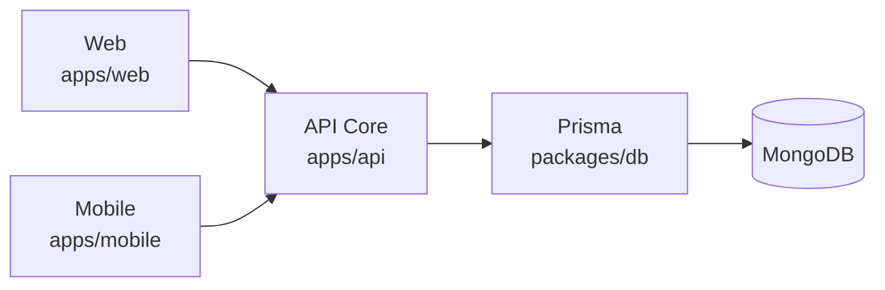
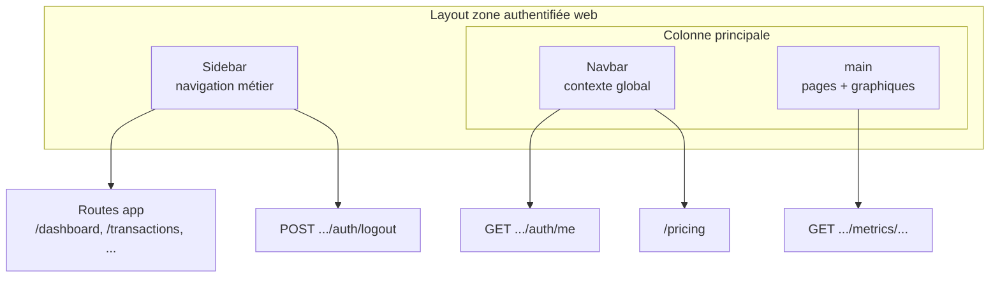

# Cahier des charges — Xaliss Manager

**Document :** spécification fonctionnelle, technique et stratégique  
**Produit :** Xaliss Manager  
**Version :** 0.1.0  
**Date :** avril 2026

---

## 1. Vision du produit

### 1.1 Présentation

**Xaliss Manager** est une plateforme de gestion financière intelligente destinée aux :

- ONG  
- Associations  
- PME  
- Coopératives  
- Structures multi-projets  
- Entreprises en croissance  

La solution permet de piloter :

- les flux financiers ;  
- les transactions ;  
- les projets ;  
- les équipes ;  
- les tableaux de bord analytiques ;  
- les opérations terrain via mobile.  

### 1.2 Positionnement multi-plateforme

| Plateforme      | Rôle principal                                                |
| --------------- | ------------------------------------------------------------- |
| Web             | Acquisition, marketing, administration avancée                |
| Mobile          | Accès rapide, terrain, consultation, exécution opérationnelle |
| API             | Cœur métier unique                                              |
| Base de données | Source unique de vérité                                        |

### 1.3 Objectifs stratégiques

- Une seule logique métier  
- Une seule base de données  
- Expérience cohérente web + mobile  
- Architecture scalable  
- Sécurité renforcée  
- Maintenance simplifiée  
- Produit prêt à industrialiser  

---

## 2. Périmètre

### 2.1 Inclus

#### Web

- Landing page marketing  
- Authentification  
- Dashboard  
- Modules métier  
- Paramètres  
- Rapports  
- Gestion utilisateurs  

#### Mobile

- Login-first  
- Sur l’écran de connexion : **lien visible vers l’inscription** (navigation vers l’écran d’inscription dans l’app, ou ouverture de l’URL d’inscription web selon le choix produit — à documenter).  
- Dashboard  
- Navigation métier  
- Actions rapides  
- Consultation temps réel  

#### Backend

- API centralisée  
- Auth unifiée  
- RBAC  
- Analytics  
- Notifications futures  

#### Data

- MongoDB unique  
- Prisma unique  
- Multi-tenant  

### 2.2 Hors périmètre initial

- Marketplace  
- Paiement en ligne avancé  
- IA prédictive complexe  
- Intégration ERP externe  
- Offline complet  
- Version desktop native  

---

## 3. Architecture cible renforcée

### 3.1 Monorepo

```txt
apps/
  web/
  mobile/
  api/

packages/
  db/
  shared/
  api-client/
  ui-tokens/
  config/
  auth/
```

### 3.2 Rôle des applications

| App           | Description                                                      |
| ------------- | ---------------------------------------------------------------- |
| `apps/web`    | Frontend Next.js public + back-office                            |
| `apps/mobile` | App Expo / React Native                                          |
| `apps/api`    | Backend dédié (Node.js — Next API / Fastify ou équivalent évolutif) |

### 3.3 Pourquoi séparer `apps/api` dès maintenant

**Améliorations par rapport à une architecture où l’API n’est que colocalisée au web :**

- Scalabilité indépendante du front web  
- Déploiement séparé (API vs marketing vs app)  
- Surface plus claire pour le mobile (URL API stable, versioning)  
- Jobs / workers futurs sans surcharger le process Next  
- Web potentiellement plus léger (SSR/marketing vs charge API)  
- API **versionnable** (`/v1/...`) sans couplage fort aux routes pages  

### 3.4 Vue architecture

```txt
Web Client   --------\
                       --> API Core (apps/api) --> Prisma --> MongoDB
Mobile Client --------/
```

**Précision :** `apps/web` peut continuer à servir la landing et le back-office ; le **métier critique** et les **clients externes** (mobile, intégrations) passent par **`apps/api`**. Le détail d’exposition (sous-domaine `api.`, reverse proxy, ou préfixe) est tranché en phase d’infra.



### 3.5 Packages partagés

#### `packages/db`

- `schema.prisma`  
- Client Prisma généré  
- Migrations / `db push` (selon politique Mongo)  
- Seed (données de référence)  

#### `packages/shared`

- Types  
- Schémas Zod  
- Constantes  
- Permissions (liste / matrice)  
- Configuration de navigation (sidebar web + mobile)  
- Helpers  

#### `packages/api-client`

- Wrapper `fetch`  
- Gestion token / refresh  
- Requêtes typées  
- Intercepteurs (erreurs, 401, retry contrôlé)  

#### `packages/auth`

- JWT (access / refresh)  
- Sessions (modèle conceptuel + validation côté API)  
- Guards / helpers d’autorisation côté **serveur**  

#### `packages/ui-tokens`

- Couleurs, espacements, typographie  
- Jetons du design system (consommation web + mobile dans la mesure du possible)  

#### `packages/config`

- Configuration typée par environnement (sans secrets en dur)  
- Schémas de variables d’environnement  

---

## 4. Architecture sécurité renforcée

### 4.1 Authentification unifiée

#### Web

- Cookies **HttpOnly**  
- **Secure** en production  
- **SameSite** strict (sauf contrainte technique documentée)  

#### Mobile

- Access token (court)  
- Refresh token (long)  
- Stockage **SecureStore** (ou équivalent)  

### 4.2 Flux recommandé

```txt
Login
  -> Access token court
  -> Refresh token long
  -> Rotation automatique du refresh
```

### 4.3 RBAC avancé

#### Rôles minimum (cible produit)

- SuperAdmin  
- Admin  
- Manager  
- Cashier  
- Viewer  

#### Permissions granulaires (exemples)

- `transaction.create` / `transaction.read` / `transaction.update`  
- `reports.export`  
- `users.manage`  

La matrice rôle → permission est **centralisée** (ex. `packages/shared`) et **appliquée uniquement côté API** (`packages/auth` + middleware / guards).

### 4.4 Multi-tenant obligatoire

Chaque enregistrement métier pertinent porte au minimum :

- `organizationId`  
- `createdBy` (ou équivalent traçabilité)  
- Horodatages (`createdAt`, `updatedAt`)  

**Isolation stricte** des données entre organisations (requêtes Prisma systématiquement filtrées ; tests d’isolation prévus).

---

## 5. Fonctionnalités web

### 5.1 Public — route `/`

Landing page :

- Hero  
- Fonctionnalités  
- Pricing  
- Contact  
- CTA login / signup  

Optimisée **SEO** (SSR / stratégie de rendu à préciser par implémentation).

### 5.2 Zone authentifiée

Layout type SaaS :

- **Sidebar**  
- **Navbar**  
- **Contenu principal** (`main`)  

### 5.3 Sidebar

Menus :

- Dashboard  
- Transactions  
- Caisses  
- Projets  
- Rapports  
- Ressources  
- Équipe  
- Paramètres  
- Déconnexion  

Libellés **i18n** ; même **configuration de navigation** partagée que le mobile (`packages/shared`).

### 5.4 Navbar

- Fil d’Ariane / titre de page  
- Profil  
- Organisation active  
- Notifications  
- Pricing  
- Recherche globale (future)  

### 5.5 Intégration technique du shell (sidebar + navbar)

La sidebar et la navbar structurent la **surface authentifiée** ; elles restent de la **présentation**. Toute règle métier et tout contrôle d’accès s’exécutent dans **`apps/api`** (pas dans le client).



| Zone UI              | Rôle                         | Dépendances typiques                          |
| -------------------- | ---------------------------- | --------------------------------------------- |
| Sidebar — navigation | Accès modules                | Routes web `/dashboard`, `/transactions`, …   |
| Sidebar — pied       | Paramètres + déconnexion     | `/settings` ; `POST .../auth/logout`          |
| Navbar — gauche      | Orientation                  | Breadcrumb / titre                            |
| Navbar — droite      | Identité, pricing, notifs    | `GET .../auth/me` ; `/pricing` ; `/profile`   |
| `main`               | Dashboard, graphiques, pages | `GET .../metrics/*` (même contrat que mobile) |

---

## 6. Fonctionnalités mobile

### 6.1 Entrée

Sans session :

```txt
Login Screen
```

Sur cet écran, l’utilisateur doit pouvoir accéder à l’**inscription** via un **lien** (ou bouton équivalent) clairement identifiable (libellé du type « Créer un compte » / « S’inscrire »), sans contourner les règles métier (ex. invitation obligatoire si applicable).

Avec session :

```txt
Dashboard
```

### 6.2 Navigation

- Bottom tabs  
- Drawer  
- Stack screens  

### 6.3 Sections métier

- Dashboard  
- Transactions  
- Caisses  
- Projets  
- Rapports  
- Ressources  
- Équipe  
- Profil  
- Paramètres  

**Parité fonctionnelle** avec la sidebar web ; forme UI native (pas de copie pixel-perfect de la sidebar).

### 6.4 Futures extensions

- Notifications push  
- Mode offline partiel  
- Scan QR  
- Signature  
- Upload photo justificatif  

---

## 7. Analytics et dashboard

### 7.1 Principe

- **Une seule source de calcul** côté serveur (`apps/api` + Prisma).  
- **Jamais** de logique d’agrégation divergente entre web et mobile.  

### 7.2 Endpoints (exemples de convention)

Les chemins exacts sont préfixés par version si besoin (`/v1/...`). Exemples :

```txt
GET /metrics/overview
GET /metrics/cashflow
GET /metrics/projects
GET /metrics/team
```

*(Le préfixe `/api` peut être celui du reverse proxy public ; la convention interne doit rester stable pour `packages/api-client`.)*

### 7.3 Format standard de réponse

```json
{
  "version": 1,
  "meta": {},
  "series": []
}
```

Schéma **Zod** dans `packages/shared` ; types consommés par web et mobile.

### 7.4 Performance analytics

Prévoir :

- index MongoDB adaptés  
- cache **Redis** (futur)  
- pagination  
- lazy loading  
- filtres par plage de dates  

---

## 8. Risques identifiés et solutions intégrées

### Risque 1 : lenteur des graphiques

**Solutions :** pipelines d’agrégation Mongo, index, cache, jobs de **pré-calcul** (futur).

### Risque 2 : auth complexe multi-plateforme

**Solutions :** package `packages/auth` partagé côté serveur, refresh token, stratégie de session unique documentée (cookies web vs Bearer mobile).

### Risque 3 : explosion des permissions

**Solutions :** matrice RBAC, middleware centralisé sur `apps/api`, tests de permissions.

### Risque 4 : divergence web / mobile

**Solutions :** config de navigation partagée, mêmes endpoints, mêmes DTO (`packages/shared`).

### Risque 5 : dette technique UI

**Solutions :** `packages/ui-tokens`, conventions de composants, documentation UI minimale mais obligatoire pour les patterns transverses.

---

## 9. Performance et qualité

### 9.1 Performance

- SSR / ISR pour la landing  
- Skeletons de chargement  
- Pagination  
- Mémoïsation raisonnable  
- Optimisation des images  

### 9.2 Qualité de code

- ESLint  
- Prettier  
- TypeScript strict  
- Husky + lint-staged (recommandé)  

### 9.3 Tests

- Tests unitaires  
- Tests d’intégration  
- Tests flux d’auth  
- Tests API  
- E2E (futur)  

---

## 10. Observabilité

À prévoir :

- logs structurés  
- monitoring des erreurs  
- alerting  
- audit logs métier  

Outils possibles (non exclusifs) : Sentry, Better Stack, PostHog, etc.

---

## 11. CI/CD

Pipeline cible :

```txt
Push
  -> Install
  -> Lint
  -> Typecheck
  -> Test
  -> Build
  -> Deploy
```

Les applications `web`, `mobile` et `api` peuvent avoir des pipelines distincts avec **artefacts** et **gates** communs (lint + typecheck au minimum).

---

## 12. Stack technique recommandée

| Couche      | Technologie                         |
| ----------- | ----------------------------------- |
| Web         | Next.js + TypeScript              |
| Mobile      | Expo + React Native + TypeScript  |
| API         | Node.js (Fastify, Hono, ou équivalent) |
| ORM         | Prisma                              |
| DB          | MongoDB                             |
| Validation  | Zod                                 |
| Cache futur | Redis                               |
| Auth        | JWT + refresh                       |
| Charts      | Recharts (web) / Victory Native ou équivalent (mobile) |
| Monorepo    | pnpm + Turborepo                    |

---

## 13. Livrables

1. Monorepo structuré **production-ready** (conventions, scripts, env).  
2. **`apps/api`** sécurisée (auth, RBAC, multi-tenant).  
3. **Web** : landing + zone authentifiée (shell sidebar/navbar + modules).  
4. **Mobile** : login-first (avec **lien vers l’inscription** sur l’écran de connexion) + dashboard + navigation métier.  
5. **Graphiques cohérents** (même contrat données web/mobile).  
6. **RBAC** opérationnel et testé sur les routes critiques.  
7. **Documentation technique** (architecture, env, déploiement).  
8. **CI/CD** initial (lint, typecheck, build).  
9. **Monitoring** initial (erreurs + audit minimal).  

---

## 14. Roadmap de réalisation

### Phase 1 — Fondations

- Monorepo  
- Prisma + MongoDB  
- Packages partagés (`db`, `shared`, `config`)  
- Variables d’environnement et secrets  

### Phase 2 — Backend core

- Auth unifiée  
- RBAC  
- Modules API  
- Metrics  

### Phase 3 — Web

- Landing  
- Dashboard  
- Modules métier  

### Phase 4 — Mobile

- Auth (login + **lien inscription** sur l’écran de connexion)  
- Navigation  
- Dashboard  

### Phase 5 — Qualité

- Tests  
- CI/CD  
- Monitoring  

### Phase 6 — Scale

- Cache  
- Notifications  
- Offline  
- IA  

Le **détail opérationnel** (micro-étapes, ordre d’exécution, définitions de terminé) est décrit en **section 17 — Plan de développement pas à pas (v0.1.0)**.

---

## 15. Critères d’acceptation

- Web public (landing) accessible et performant.  
- Mobile : ouverture sur **login** si non connecté ; **lien vers l’inscription** présent sur cet écran ; accès **dashboard** si session valide.  
- **Mêmes données** agrégées pour les indicateurs clés sur web et mobile (même API / même logique).  
- **Une seule** base MongoDB et **un seul** schéma Prisma officiels.  
- **Aucun secret** serveur (DB, JWT de signature refresh, etc.) dans le bundle mobile.  
- **Permissions** respectées sur toutes les routes sensibles testées.  
- Dashboard fluide (skeletons, erreurs réseau gérées).  
- **Build CI** vert sur les jobs minimaux définis.  
- Projet **maintenable** (packages, règles d’import, documentation à jour).  

---

## 16. Conclusion

Xaliss Manager vise une plateforme **SaaS moderne**, **extensible**, **sécurisée** et **prête à croître** sur plusieurs marchés, avec une séparation explicite **Web / Mobile / API / Data** et des packages partagés pour limiter la dette et les divergences.

**Le présent document (version 0.1.0) constitue la base officielle de développement**, sous réserve de validation par le porteur produit et l’équipe technique.

---

## 17. Plan de développement pas à pas (v0.1.0)

Ce plan complète la **roadmap** (section 14) par des **micro-étapes** ordonnées. Il part de l’état actuel du dépôt (**application Next.js** à la racine) et vise l’architecture cible (**monorepo** `apps/web`, `apps/mobile`, `apps/api`, `packages/*`). Chaque étape doit être **validée** avant d’enchaîner la suivante.

### 17.1 Principes d’exécution

### 17.1 Principes d’exécution et jalons

**Principes**

- **Une étape = un résultat vérifiable** (build, test automatisé minimal, ou procédure manuelle courte documentée dans le dépôt).  
- **API-first pour les données métier** : contrats JSON stables et versionnés (`/v1/...`) avant d’enrichir l’UI ; le web ne recalcule pas en doublon ce que l’API agrège déjà.  
- **Ne pas ajouter** `apps/mobile` (Expo) tant que l’API n’expose pas de façon stable au minimum **auth** (login / refresh ou équivalent) et **`me`** (identité + organisation active).  
- **CI minimale tôt** : dès que deux packages ou apps existent, un job racine *install + lint + typecheck* (build complet peut suivre à l’étape 10).  
- **Zéro secret dans le mobile** : revue de dépendances et d’`app.config` / EAS à chaque étape touchant `apps/mobile`.  
- Après chaque étape impactant le build : **`lint`** et **`build`** (ou `typecheck` à défaut) sur le périmètre modifié.

**Jalons v0.1.0 (repères de livraison)**

| Jalon | Contenu agrégé | Liens d’étapes |
| --- | --- | --- |
| **M1 — Socle repo** | Monorepo, DB package, API `health`, web squelette ou landing minimale | 0 → 4 |
| **M2 — Identité** | Auth sur `apps/api`, session web, `me`, premier écran dashboard protégé | 5 → 6 |
| **M3 — Vertical données** | RBAC + multi-tenant sur un module critique, premier endpoint métriques + graphique web | 6 → 7 |
| **M4 — Parité mobile** | Expo login-first (lien inscription), dashboard aligné métriques, navigation depuis `shared` | 8 → 9 |
| **M5 — Industrialisation** | CI verte, observabilité minimale, README onboarding | 10 → 11 |

### 17.2 Ordre des grandes dépendances


### 17.3 Étape 0 — Cartographie et garde-fous

| | |
| --- | --- |
| **Objectif** | Comprendre l’existant avant toute restructuration ; lister risques et dépendances. |
| **Actions** | Inventorier `src/app/api/**` (auth, métier) ; parcourir Prisma (`prisma/schema.prisma`) et usages ; noter les layouts zone authentifiée (`src/app/**/layout.tsx` avec `Sidebar` / `Navbar`) ; recenser les variables d’environnement (`env.example`, `.env.local` hors dépôt) ; identifier les endpoints sensibles (register, invitations, logout). |
| **Définition de terminé** | Document court (même dépôt : `docs/audit-etape-0.md` ou section README) : tableau routes API, schéma auth actuel, liste env + secrets, **aucune** modification de comportement produit. |
| **Risque principal** | Omettre un flux implicite (cookie, redirection) et le casser aux étapes suivantes. |

### 17.4 Étape 1 — Monorepo minimal

| | |
| --- | --- |
| **Objectif** | Introduire la structure monorepo **sans** changer le comportement utilisateur du site. |
| **Actions** | Racine avec workspaces (`pnpm-workspace.yaml`) et orchestration (`turbo.json` ou équivalent) ; déplacer le code Next actuel vers `apps/web` (ou équivalent documenté) ; scripts racine `dev`, `build`, `lint` qui délèguent à `apps/web`. |
| **Définition de terminé** | `pnpm install` à la racine ; `pnpm dev` lance l’app comme aujourd’hui ; un seul `package-lock` ou lockfile pnpm selon choix outil **figé** dans la doc. |
| **Risque principal** | Chemins cassés (`@/` alias, `public/`, CI) si les dossiers ne sont pas mis à jour partout. |

### 17.5 Étape 2 — Package `packages/db`

| | |
| --- | --- |
| **Objectif** | Une seule source **Prisma** + client généré partagé par les futurs `apps/web` et `apps/api`. |
| **Actions** | Déplacer `prisma/` dans `packages/db` ; exporter un singleton `PrismaClient` (usage **serveur uniquement**) ; script `prisma generate` depuis le package ; documenter `DATABASE_URL`. |
| **Définition de terminé** | `apps/web` (ou API temporaire) importe `@org/db` (nom à trancher) ; `npx prisma validate` OK ; aucune duplication de `schema.prisma`. |
| **Risque principal** | Importer Prisma dans du code client ou bundle mobile par erreur. |

### 17.6 Étape 3 — Package `packages/shared`

| | |
| --- | --- |
| **Objectif** | Mutualiser types, Zod et **configuration de navigation** (alignement sidebar web / futur mobile). |
| **Actions** | Extraire les schémas minimaux (login payload, réponse `me` si stable) ; constantes et liste d’entrées de menu (routes, clés i18n, flags `web` / `mobile`) ; aucune logique UI dans ce package. |
| **Définition de terminé** | La sidebar web consomme la liste partagée (ou un premier sous-ensemble) ; build web OK. |
| **Risque principal** | Sur-abstraction trop tôt ; commencer petit, étendre par besoin réel. |

### 17.7 Étape 4 — `apps/api` (socle HTTP)

| | |
| --- | --- |
| **Objectif** | Process dédié **API Core**, séparé du rendu Next, prêt à recevoir la logique métier. |
| **Actions** | Créer `apps/api` avec framework HTTP choisi (Fastify, Hono, etc. — **décision documentée une fois**) ; healthcheck `GET /health` ; CORS restrictif ; logs structurés minimal ; branchement Prisma depuis `packages/db` **uniquement** ici pour des lectures simples de test. |
| **Définition de terminé** | L’API démarre en local ; healthcheck OK ; aucune clé secrète en dur ; variables d’env listées. |
| **Risque principal** | CORS trop large ou secrets exposés dans les logs. |

### 17.8 Étape 5 — Migration auth vers l’API

| | |
| --- | --- |
| **Objectif** | Auth unifiée consommée par le web (puis le mobile) : login, logout, refresh (si applicable), `me`. |
| **Actions** | Implémenter les routes sur `apps/api` ; définir stratégie **cookies HttpOnly** (web) vs **Bearer** (mobile) ; période de coexistence possible : `apps/web` proxy vers `apps/api` ou double implémentation temporaire **bien bornée dans le temps**. |
| **Définition de terminé** | Parcours login web fonctionnel bout-en-bout via la nouvelle chaîne ; `me` alimente la navbar comme avant ; logout invalide la session côté serveur. |
| **Risque principal** | Régression cookies / SameSite / chemins de cookie entre environnements. |

### 17.9 Étape 6 — RBAC et multi-tenant

| | |
| --- | --- |
| **Objectif** | Appliquer systématiquement `organizationId` et permissions sur les handlers API sensibles. |
| **Actions** | Matrice rôles / permissions dans `packages/shared` + enforcement dans `apps/api` (middleware ou guards) ; auditer les requêtes Prisma pour filtre tenant ; tests sur au moins un module critique (ex. transactions ou équipe). |
| **Définition de terminé** | Impossible d’accéder aux données d’une autre organisation dans les scénarios testés ; documentation de la matrice. |
| **Risque principal** | Oublis de filtre sur une route secondaire (fuite inter-tenant). |

### 17.10 Étape 7 — Métriques et graphiques (premier vertical)

| | |
| --- | --- |
| **Objectif** | Un **premier** flux « données agrégées → JSON stable → graphique web ». |
| **Actions** | Endpoint `GET /metrics/...` (ou préfixe versionné) ; schéma Zod `version` / `meta` / `series` dans `shared` ; brancher **un** graphique du dashboard sur cette source (sans dupliquer la logique côté client). |
| **Définition de terminé** | Même agrégation appelable par outil (curl) et affichée correctement dans l’UI ; gestion loading / erreur. |
| **Risque principal** | Performance (absence d’index Mongo) — prévoir mesure simple avant d’optimiser. |

### 17.11 Étape 8 — `apps/mobile` (Expo)

| | |
| --- | --- |
| **Objectif** | Application mobile **login-first**, avec **lien vers l’inscription** (écran in-app ou URL web selon décision produit § 6.1). |
| **Actions** | Initialiser Expo dans `apps/mobile` ; écran login + lien inscription ; intégration `packages/api-client` (base URL, headers) ; stockage refresh sécurisé ; premier appel `me` après login ; écran dashboard minimal (données ou graphique aligné sur l’étape 7). |
| **Définition de terminé** | Build développement mobile OK ; parcours login → dashboard sur device ou simulateur ; aucun secret serveur dans l’app. |
| **Risque principal** | Mauvaise gestion du refresh / 401 en cascade. |

<<<<<<< HEAD
**Décisions attendues avant démarrage**

- **Inscription mobile :** confirmer si l’inscription est in-app (`/register` mobile) ou redirection vers URL web publique.
- **Stratégie tokens :** access token court + refresh token persistant (recommandé) avec rotation côté API.
- **Stockage sécurisé :** `expo-secure-store` (ou équivalent validé) ; aucun token dans AsyncStorage.
- **Base URL par environnement :** dev local, preview, production via variables Expo/EAS sans valeurs en dur.

**Sous-tâches d’implémentation**

1. **Bootstrap Expo**
   - Créer `apps/mobile` avec TypeScript, navigation de base et conventions de dossiers.
   - Ajouter scripts workspace (`dev`, `android`, `ios`, `lint`, `typecheck`).
2. **Couche réseau**
   - Consommer `packages/api-client` (instance HTTP unique + interceptors).
   - Gérer timeout, mapping erreurs API et stratégie de retry non agressive.
3. **Auth mobile**
   - Écran login + validation minimale + message d’erreur UX clair.
   - Lien visible vers inscription selon décision produit.
   - Stocker/recharger session ; déclencher `GET /auth/me` après login et au cold start.
4. **Refresh et garde de session**
   - Sur 401, tenter refresh une seule fois puis rejouer la requête initiale.
   - En cas d’échec refresh: purge session + retour écran login.
5. **Dashboard minimal**
   - Afficher identité (`me`) et au moins une donnée issue des métriques étape 7.
   - États requis : loading, vide, erreur réseau, mode reconnect.

**Critères d’acceptation complémentaires (QA)**

- Login valide sur appareil réel ou émulateur, puis ouverture dashboard en moins de 3 actions utilisateur.
- Reprise de session après fermeture/réouverture de l’app sans re-login immédiat (si refresh valide).
- Expiration volontaire du token testée: refresh fonctionne ou logout propre sans boucle.
- Lien inscription accessible et conforme à la décision produit (écran ou webview/browser).
- Vérification sécurité: aucun token/log sensible dans console release.

**Checklist technique (Done)**

- `apps/mobile` présent dans le monorepo et intégré aux scripts racine.
- Variables d’environnement mobile documentées (`EXPO_PUBLIC_API_URL`, etc.).
- Flux auth documenté dans `README` (diagramme court ou pseudo-flow).
- Tests minimaux ajoutés sur la couche auth (au moins unitaires sur logique refresh).
- Build de dev validé (`expo start`) + un build preview (EAS ou alternative choisie).

=======
>>>>>>> f83ab1a772188044adad3cd39c72a329ac1d0bf7
### 17.12 Étape 9 — Parité de navigation mobile

| | |
| --- | --- |
| **Objectif** | Accès aux **mêmes sections métier** que la sidebar web, avec UI native (tabs / drawer / stacks). |
| **Actions** | Consommer la config `packages/shared` pour construire le menu mobile ; implémenter progressivement les stacks par section (dashboard, transactions, etc.) même si certaines écrans sont des placeholders au début. |
| **Définition de terminé** | Navigation cohérente avec la liste officielle du cahier ; pas de divergence de noms de routes métier sans décision documentée. |
| **Risque principal** | Divergence web/mobile si la config partagée n’est pas la source unique. |

### 17.13 Étape 10 — Qualité, CI/CD, observabilité

| | |
| --- | --- |
| **Objectif** | Industrialiser : pipeline minimal, monitoring, doc à jour. |
| **Actions** | Pipeline : install → lint → typecheck → test (même réduit) → build pour `web`, `api`, et `mobile` si applicable ; intégration erreurs (ex. Sentry) sur au moins `api` + `web` ; README monorepo (commandes, env, architecture). |
| **Définition de terminé** | CI verte sur la branche principale ; guide onboarding développeur < 1 journée pour clone → run local. |
| **Risque principal** | CI trop lente ou flaky — commencer par un sous-ensemble de jobs puis étendre. |

### 17.14 Étape 11 — Scale (hors v0.1.0 minimal, planifiée)

| | |
| --- | --- |
| **Objectif** | Préparer la phase 6 de la roadmap sans l’exiger pour clore la v0.1.0. |
<<<<<<< HEAD
| **Actions** | Formaliser le backlog scale dans `docs/scale-backlog.md` avec priorisation `P0/P1/P2`, lotissement recommandé, et template standard (Objectif / Actions / Definition of Ready / Definition of Done / Risque / Dépendances / Estimation). |
| **Définition de terminé** | Backlog priorisé et validé métier ; pas d’implémentation obligatoire pour la version document 0.1.0. |
| **Risque principal** | Scope creep — garder la v0.1.0 livrable avant d’ouvrir ces chantiers. |

**Résultat attendu de l’étape 11 (livrables documentaires)**

- Un backlog unique et versionné (`docs/scale-backlog.md`) couvrant: cache Redis, notifications push, offline partiel, IA.
- Un ordre d’exécution proposé en lots (`Lot A -> Lot D`) pour limiter le risque de dérive.
- Des critères **Ready** / **Done** explicites pour ouvrir/fermer chaque chantier.
- Aucune implémentation technique obligatoire sur `apps/*` et `packages/*` pour valider cette étape.

=======
| **Actions** | Backlog : cache Redis, notifications push, offline partiel, IA ; chaque item = future **étape** avec même structure (objectif / actions / DoD / risque). |
| **Définition de terminé** | Backlog priorisé et validé métier ; pas d’implémentation obligatoire pour la version document 0.1.0. |
| **Risque principal** | Scope creep — garder la v0.1.0 livrable avant d’ouvrir ces chantiers. |

>>>>>>> f83ab1a772188044adad3cd39c72a329ac1d0bf7
---

*Document v0.1.0 — inclut notamment le shell web (sidebar / navbar, APIs transverses) et les exigences mobile (login-first, lien inscription).*